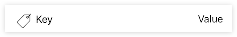
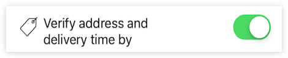
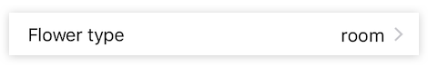
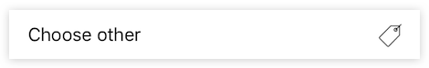
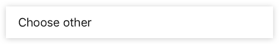

# DARFormBuilder

Library made to cut corners when making complex forms using UITableView.


## Installation using cocoapods

Add `pod DARFormBuilder` to your podfile and run `pod install`


## Components

Framework provides two types of controllers to build forms. One is basic with less abstraction and another one is more feature-packed.


### FormTableViewController

This controller just renders a layout with the cells you provide. You pass it an array of views for them to be rendered in a table. Framework provides a full-featured set of fields that you can use here. You can also pass your own views to be rendered inside the cells.

Example:

```Swift
let nameField = TextInput()
let titleField = TextInput()
let birthdayField = DateInput()
let likesBoobiesField = SwitchInput()

let tbl = FormTableViewController()
tbl.rows = [
    Row(titleField, nameField),
    Row(birthdayField),
    Row(likesBoobiesField)
]
```


#### Field Validation

When using `FormTableViewController` you are responsible for validating fields and reacting to field values changes. For validation purposes built-in input classes have an `errors` property which will return a list of error messages for a given field. `errors` array being empty means that field has passed validation.


### List of available field types

#### HeadingLabel 

Cell for displaying form titles with description. Big font, contrasty color.


```Swift
let h1 = HeadingLabel(
    title: "Flower order", 
    description: "This is a demonstration of framework capabilities on a case of building flower delivery order form."
)
```


#### TextInput

Simple textField. Can be limited by max length. Placeholder can be floating.

  


#### DateInput

Date picker. Supports different input modes.


#### PhoneInput

Phone input. Can display only digits.


#### KeyValueField

Label with key and value on the right, left side can contain image.

   


#### KeyNumDialField

Label with number dial. Values can be limited by range.


```Swift
let dialField = KeyNumDialField("Кол-во", value: 2, range: 0..<10)
dialField.onNumberChange = { [weak self] (value: Int) in
    // Take this number!            
}
```


#### KeySwitchField

Label with switch view on the right and can contain image on the left.

  


#### SelectField

Label with disclosure indicator, can contain image, detail label on left side. Clickable.

  


#### SelectFieldWithAction

Label with image on left side. Clickable.

  

```Swift
let selectActionField = SelectFieldWithAction("Choose other")
selectActionField.action = { action in
   // Do some action
}
```


## DARFormController

Framework offers a convenient controller for building forms. It is instantiated using a JSON configuration file, which can provide fields configurations, initial values and interaction logic.

Below is a JSON config example:

```Javascript
{
    "fields": [
        {
            "key": "name",
            "type": "textInput",
            "label": "Name",
            "maxLength": 60,
            "required": true
        },
        {
            "key": "hideFields",
            "type": "switchInput",
            "label": "Hide Fields",
            "hideFieldsIfChecked": [0]
        },
        ...
    ],
}
```

### Available field types and their settings

#### `textInput`
A simple textInput with floating label.

Params:

- `label: String = ""` — Placeholder/floating label text
- `keyboardType: String(default|email|phone|number) = "default"` — Keyboard type to display for this field
- `maxLength: Int = 0` — Maximum text length
- `required: Bool = false` — Field will not pass validation if text is not present

#### `dateInput`
Date input with floating label.

Params:
- `label: String = ""` — Placeholder/floating label text
- `inputMode: String(datetime|date|time) = "datetime"` — Date input mode to display for this field
- `displayFormat: String = "dd.MM.yyyy"` — Display date format in [unicode format pattern](http://www.unicode.org/reports/tr35/tr35-31/tr35-dates.html#Date_Format_Patterns)
- `valueFormat: String = “yyyy-MM-dd'T'HH:mm:ss.SSSXXXXX”` — Field value format in [unicode format pattern](http://www.unicode.org/reports/tr35/tr35-31/tr35-dates.html#Date_Format_Patterns)
- `required: Bool = false` — Field will not pass validation if text is not present

#### `phoneInput`
Phone input with floating label.

Params:
- `label: String = ""` — Placeholder/floating label text
- `displayFormat: String = "+7 ### ###-##-##"` — Phone number formatting mask
- `pickFromContacts: Bool = false` — Display pick from contacts button on the field
- `required: Bool = false` — Field will not pass validation if text is not present

#### `switchInput`
Switch with label on the left.

Params:
- `label: String = ""` — Label text
- `hideFieldsIfChecked: [Int] = []` — Form should hide fields at given indices if the switch is on


***

This framework is built and maintained by DAR Team. Please check out our products!
